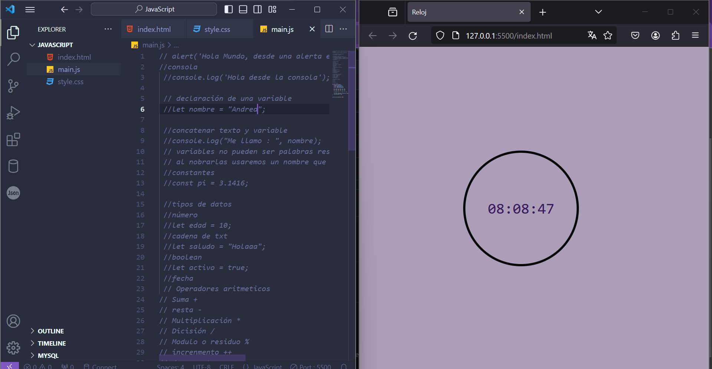

# Clon del navegador de Google

proyecto realizado como practica del botcamp de tecnolochicas
## ¿que construí?

En este proyecto tuve como proposito construir junto con mi mentora un reloj digital.

## ¿Qué tecnologías utilicé?

## Mi objetivo es:

Aprender a utilizar los distintos lenguajes y las etiquetas principales de CSS, HTML y JS.

## mira aqui mi proyecto:

🔗 [Reloj](https://reloj-digital-zeta.vercel.app/)

